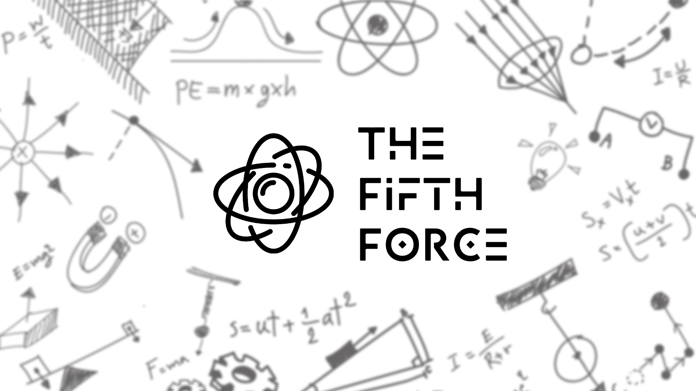

[Back to Portfolio](./)

The Fifth Force
===============

-   **Class: Senior Project** 
-   **Grade: N/A**
-   **Language(s): C#, JSON**
-   **Source Code Repository:** [features/mastering-markdown](https://guides.github.com/features/mastering-markdown/)  
    (Please [email me](mailto:example@csustudent.net?subject=GitHub%20Access) to request access.)

## Project description

The Fifth Force is a virtual reality (VR) puzzle game built in Unity3D. The game is very much inspired by other games such as Portal, Q.U.B.E. 2, and The Lab. The gameplay centers around a hobbist scientist who goes through various puzzles in an attempt to further humanitie's understanding of physics and one day discover the fifth fundamental force of physics!

## How to compiles / run the program

Running the program will require any PC based VR headset. Officially supported and tested headsets include:
- Valve Index (primary development device)
- Oculus Rift S
- Oculus Quest 2

To run the game simply download the source files and run thefifthforce.exe.

## UI Design

UI design was heavily inspired by other VR titles. I attempted to make the UI as intuitive and easy to use as possible. Most in game UI centers around a device worn on the player's left wrist. By turning the left hand palm up and looking toward the wrist, the player can activate the in game UI which allows them to access various powers and game settings.

Fig 1. The launch screen

Fig 2. Example output after input is processed.

Fig 3. Feedback when an error occurs.

## Gameplay 

Since the theme of the game is based around the fundamental forces of physics, it was important to me that object interactions be as physically accurate as possible. To achieve this I utilized a physics based movement system for the player controller. This allows the player to grab any object in the game with their hands. The player can also climb and explore by physically interacting with the environment. 

The game is split into five separate sections. Each of the first four sections are themed around one of the four fundamental forces of physics (Gravitational, electromagnetic, strong force, and week force). The final section of the game explores what the fifth force of physics might be like and has the player using it to solve the final puzzles of the game!

## 3. Additional Considerations

This project is still under active development and has been quite the undertaking. I hope to have it completely finished in time to present in the fall of 2021. To see a more detailed look into the design process that I followed, please view the official game design document here: https://www.notion.so/masonbradford/Game-Design-Document-ee9694ded78a4c12a8a0f38d82ea9009

[Back to Portfolio](./)