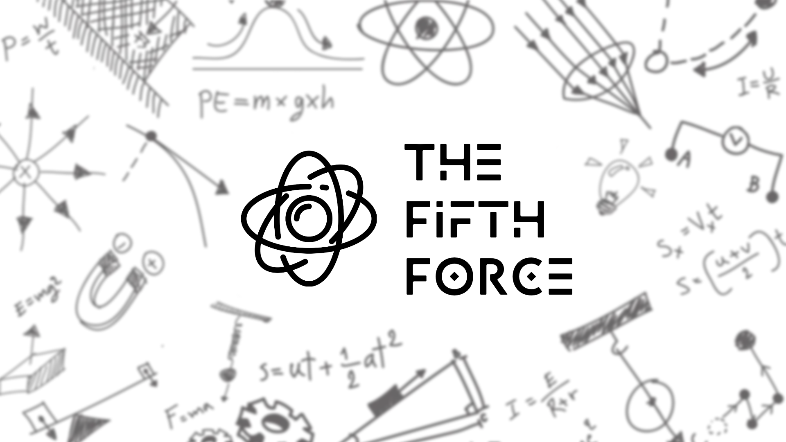
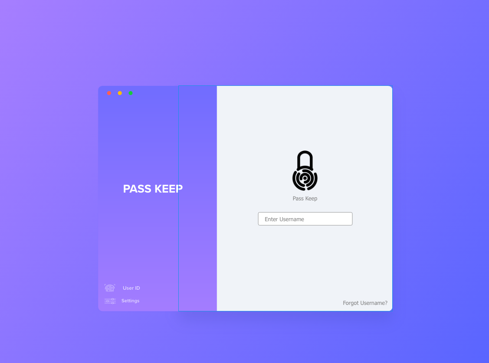
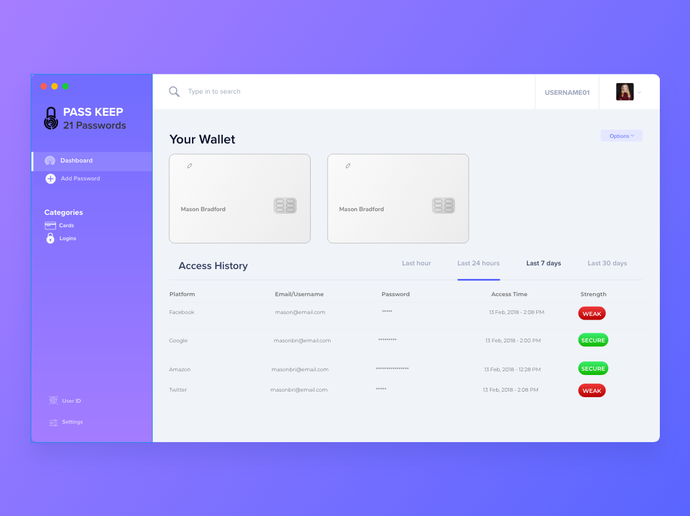

[Back to Portfolio](./)

PassKeep
===============

-   **Class: CSCI 325 Object Oriented Programming** 
-   **Grade: B**
-   **Language(s): Java**
-   **Source Code Repository:** [source](https://github.com/MasonKomo/PassKeep-Password-Manager)  
    (Please [email me](mailto:mason.c.bradford@gmail.com?subject=GitHub%20Access) to request access.)

## Project description

PassKeep is a password manager that was built in Java and uses JavaFX for it's UI. The goal was to provide an secure, offline means of storing your usernames and passwords for websites. I worked with three additional teammates on this project. I was primarily tasked with UI design and programming but I did end up doing most of the legwork for the project. (Commiting 23 times out of 24 total commits.)

## How to compiles / run the program

Currently broken for some reason. Working on a fix!

## UI Design

For the UI I initially looked to dribble and behance for inspiration. I also sampled some existing password managers such as 1password and Dashlane. Then I went into Adobe Experience Design and put together some design mockups. I also used FramerX to get an idea of how animations should look since it had better animation prototyping at the time. 

Fig 1. Login mockup. 

Fig 2. Dashboard mockup (included credit card storage but the feature was later cut).

Fig 3. Adding a password mockup.

## UI Programming
 
After I created a few mockups to go off of I began to put together the UI using JavaFX. 

Fig 1. NEEDS TO BE UPDATED!

## 

## Additional Considerations

Due to time constraints, our initial encryption method was swapped out for a built in method provided by Java. While it isn't as secure as what we initially wanted to use, it got the job done and allowed us to submit the final build before the deadline. 

[Back to Portfolio](./)