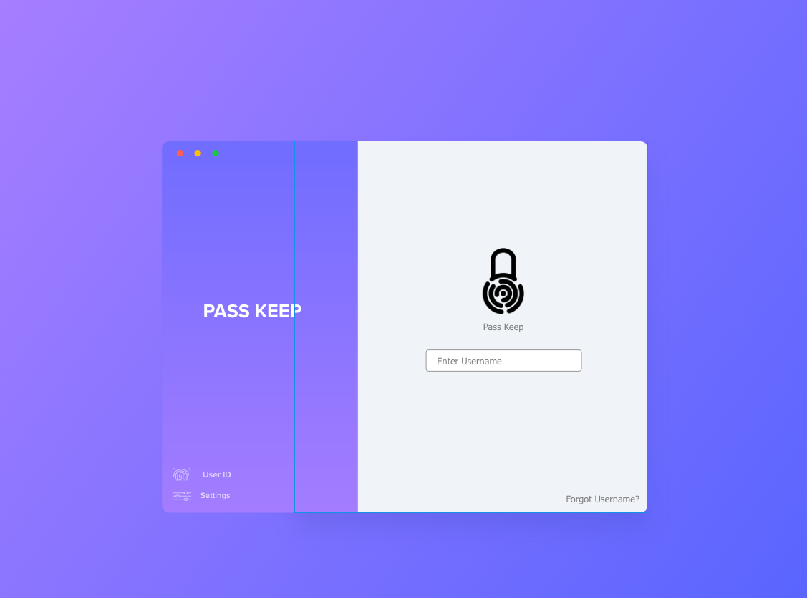
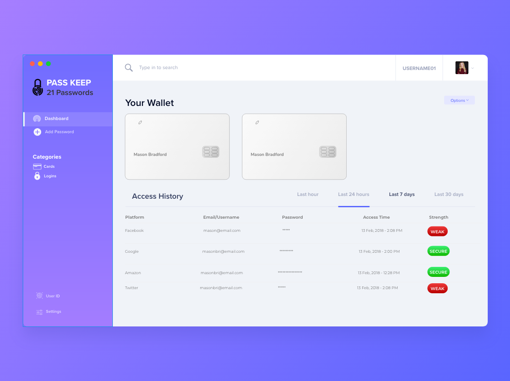
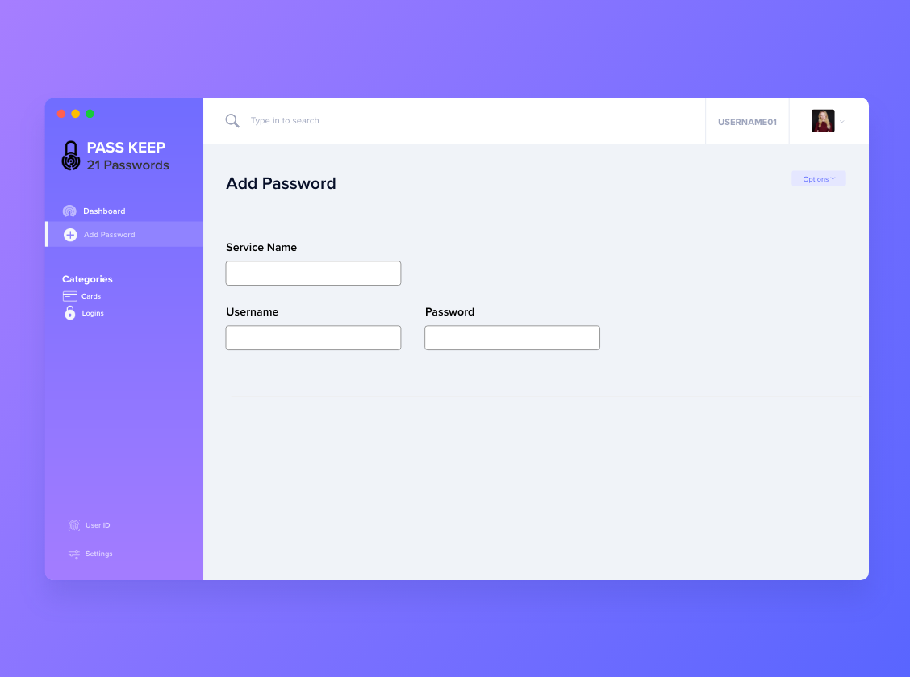

[Back to Portfolio](./)

Rae's Riders Website
===============

-   **Class: CSCI 495 Systems Analysis and Design** 
-   **Grade: B**
-   **Language(s): HTML, CSS, SCSS, MySQL**
-   **Source Code Repository:** [source](https://github.com/MasonKomo/PassKeep-Password-Manager)  
    (Please [email me](mailto:mason.c.bradford@gmail.com?subject=GitHub%20Access) to request access.)

## Project description

Rae's Riders is a project for a real world client that my team was tasked with completing. The client requested a website that she could use to aid her in running her company where she provided horseback riding lessons. The main requirements included a functioning website that would allow customers to create an account and register for lessons. The client also requested an admin functionality for the website that would allow instructors to approve, cancel, or make adjustments to lessons. 

Additionally, my team provided a database to store customer and instructor information. 

My primary responsibilties revolved around UI design and implementation. 

## How to compiles / run the program

Currently broken for some reason. Working on a fix!

## UI Design

For the UI design I attempted to stick as closely to Google's Material design guidelines. The dashboard was kept as clean as possible to make it easier for customers and instructors to navigate the website. 

Fig 1. Login mockup. 

Fig 2. Dashboard mockup (included credit card storage but the feature was later cut).

Fig 3. Adding a password mockup.

## UI Programming
 
After I created a few mockups to go off of I began to put together the UI using JavaFX. 

Fig 1. NEEDS TO BE UPDATED!

## Additional Information

Our team also provided a full user guide that I contributed to. The user guide can be viewed here: https://drive.google.com/file/d/1rGYU3sqKbn-VLhqEZWlaMZdrtypV8m34/view?usp=sharing

[Back to Portfolio](./)